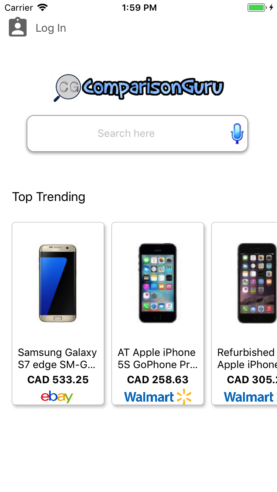
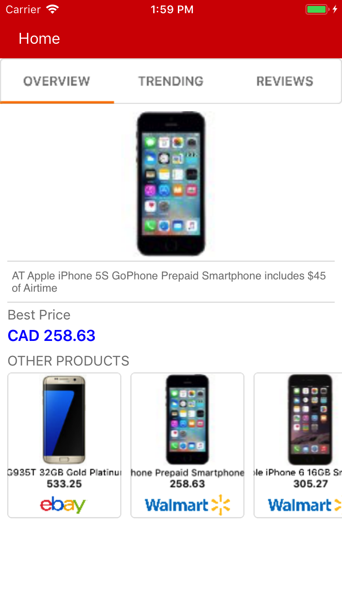
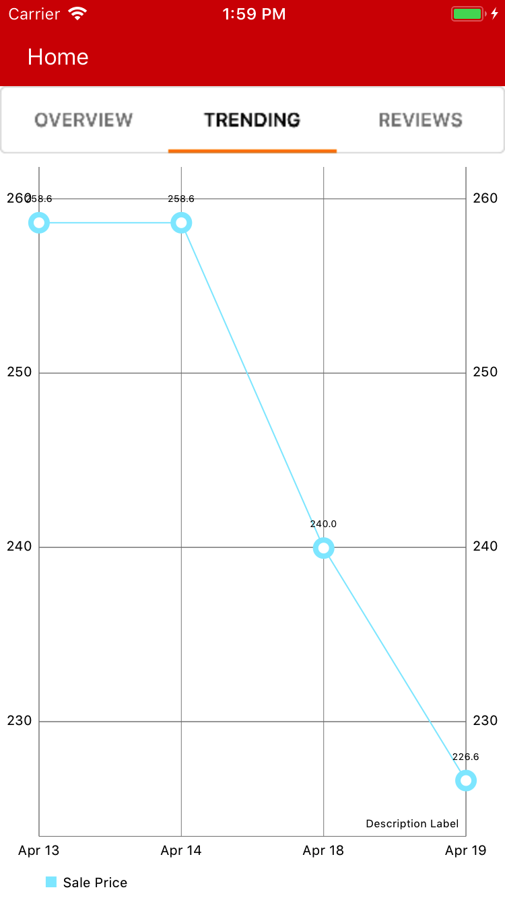
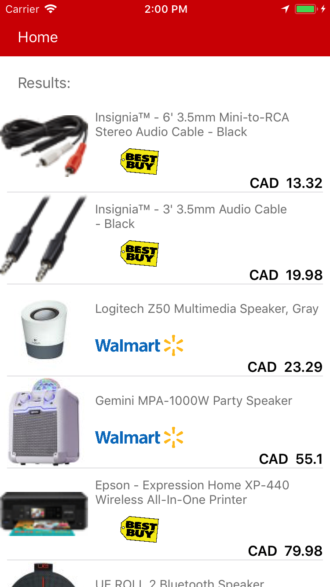

# ComparisonGuru-iOS
Comparison Guru is a search engine that people can use to compare prices of a product across major online stores in US and Canada, like Amazon, Best Buy, eBay, and Walmart. Using this search engine will help buyers significantly reduce the search time when finding the cheapest price of a product and to maximize their best possible savings.

## Screenshots

